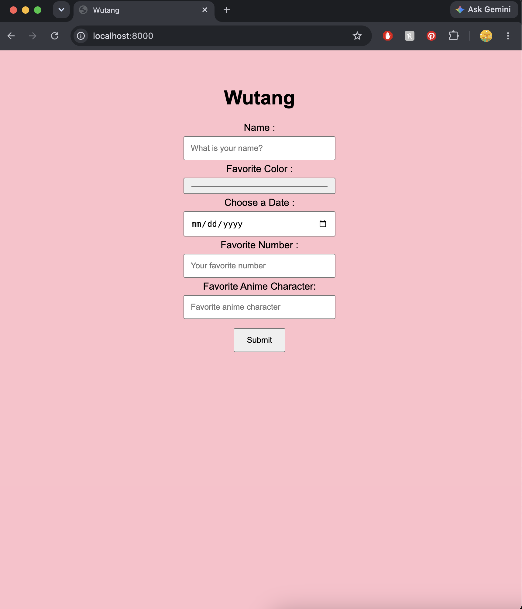
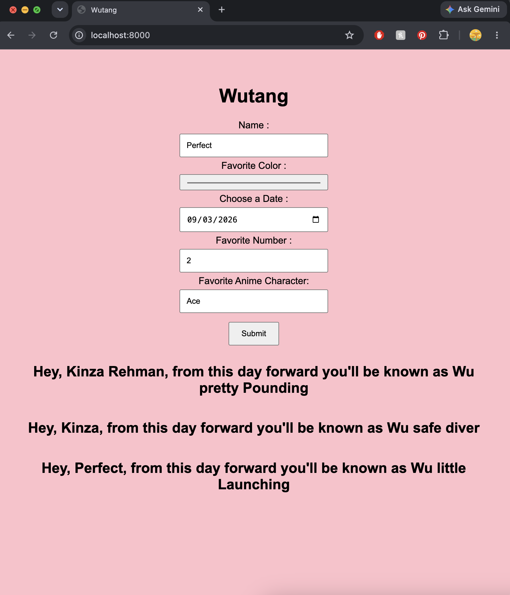

# 🎤 Wu-Tang Name Generator

## Goal

Create a Wu-Tang-inspired name generator. The user answers **5 survey questions**, and their answers are combined to generate a unique Wu-Tang-style name.

The generated names don't have to be actual Wu-Tang Clan names, just something that sounds like it could be one.

Fun fact: Childish Gambino got his stage name from an online Wu-Tang name generator.

## Images

<p align="center">
  
  
</p> 

## How to Play

1. Enter your name.
2. Answer the 5 survey questions.
3. Click the **Submit** button.
4. Your answers are combined and converted into binary.
5. The binary value is sent to the server.
6. The server uses that value to select a first and last name.
7. Your Wu-Tang name is displayed on the page.
8. Using the same answers will generate the same Wu-Tang name.

## Built With

- HTML
- CSS
- JavaScript
- Node.js
- Node.js HTTP module
- Node.js File System (`fs`) module
- Fetch API

## Logic

The generator uses the user's answers to create a consistent name instead of choosing a completely random name each time.

First, the five answers are combined into one string.

```js
const combineInput = name + color + date + number + character;
```

Each character is then converted into binary.

```js
const binary = combineInput
    .split("")
    .map(character => character.charCodeAt(0).toString(2))
    .join("");
```

The binary value is converted into a number on the server.

```js
const inputNumber = parseInt(userInput, 2);
```

That number is used to select a first name from the first array.

```js
const firstName = inputNumber % array1FirstName.length;
const userFirstName = array1FirstName[firstName];
```

The number is then divided by the length of the first-name array before selecting a last name.

```js
const lastName =
    Math.floor(inputNumber / array1FirstName.length)
    % array2LastName.length;

const userLastName = array2LastName[lastName];
```

Finally, the two values are combined to create the user's Wu-Tang name.

```js
const wutangName = `${userFirstName} ${userLastName}`;
```

Because the calculation is based on the user's answers, **the same five answers will always generate the same name**.